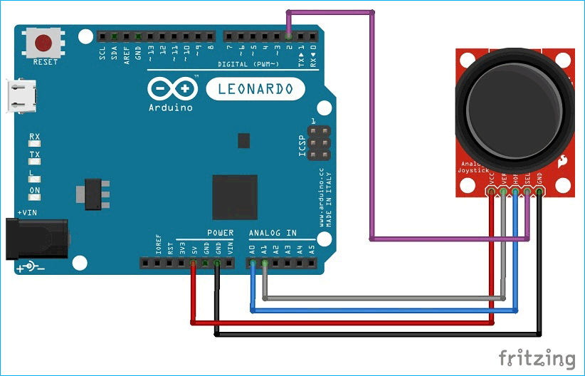
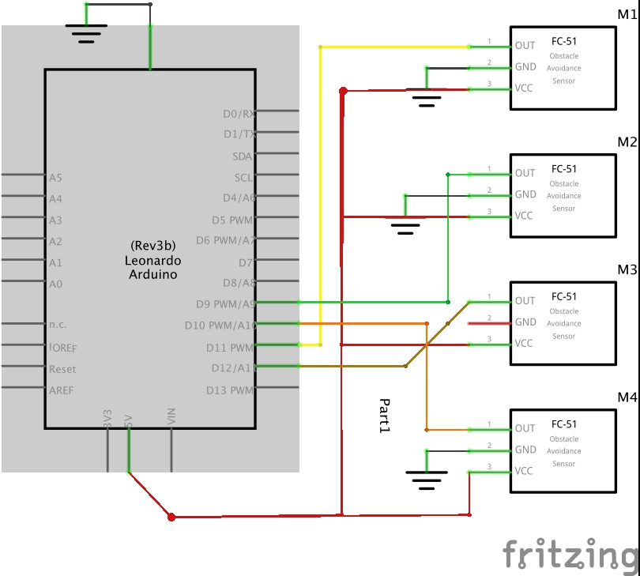

# Hand Gesture and Joystick Control


## Description

Hand Gesture and Joystick Control is an Arduino-based project that allows users to control their PC or laptop using hand gestures or a joystick. This project is designed to enhance user interaction with applications such as video players and games.

## STAR Method

### Situation
In today's world, touchless and intuitive control systems are becoming increasingly important. This project aims to provide an innovative solution for controlling PCs and laptops using hand gestures and a joystick.

### Task
Develop a system that uses IR sensors and a joystick to control keyboard inputs, allowing users to interact with their devices without physical contact.

### Action
- Implemented IR sensors to detect hand gestures.
- Integrated a joystick module to provide additional control options.
- Used Arduino Leonardo to emulate keyboard inputs based on sensor readings.

### Result
The project successfully allows users to control their devices using hand gestures and a joystick, providing a seamless and intuitive user experience.

## Key Features

- Control PC/laptop using hand gestures.
- Joystick module for additional control.
- Visual feedback using LEDs.
- Compatible with various applications such as video players and games.

## Demonstration

### Video 1: Hand Gesture Control
<video alt="Hand Gesture Control" src="demo/Hand_gesture_control_IR_Pacman_compressed.mp4"></video>

### Video 2: Joystick Control
<video alt="Joystick Control" src="demo/Joystick_game_controller.mp4"></video>


## Diagrams

### Circuit Diagrams



### Circuit Schema



### Hand Gesture Detection


## Installation

1. Clone the repository:
   ```sh
   git clone https://github.com/yourusername/HandGestureJoystickControl.git
   ```
2. Open the `Hand_gesture_control.ino` file in the Arduino IDE.
3. Connect the Arduino Leonardo board to your PC.
4. Upload the code to the Arduino board.

## Usage

1. Ensure the IR sensors and joystick are connected as per the circuit diagram.
2. Power on the Arduino board.
3. Use hand gestures or the joystick to control your PC/laptop.

## Contribution Guidelines

We welcome contributions from the community. To contribute:

1. Fork the repository.
2. Create a new branch (`git checkout -b feature-branch`).
3. Make your changes.
4. Commit your changes (`git commit -m 'Add new feature'`).
5. Push to the branch (`git push origin feature-branch`).
6. Create a pull request.

## Technologies and Tools Used

- Arduino IDE
- Arduino Leonardo
- IR Sensors
- Joystick Module
- LEDs

## Practical Applications

- Control video players (play, pause, volume control).
- Basic game controls (arrow keys, space, enter).
- Accessibility solutions for users with limited mobility.

## Future Improvements

- Add more gestures for additional controls.
- Integrate voice commands.
- Enhance the accuracy of gesture detection.

## License

This project is licensed under the MIT License - see the LICENSE file for details.


